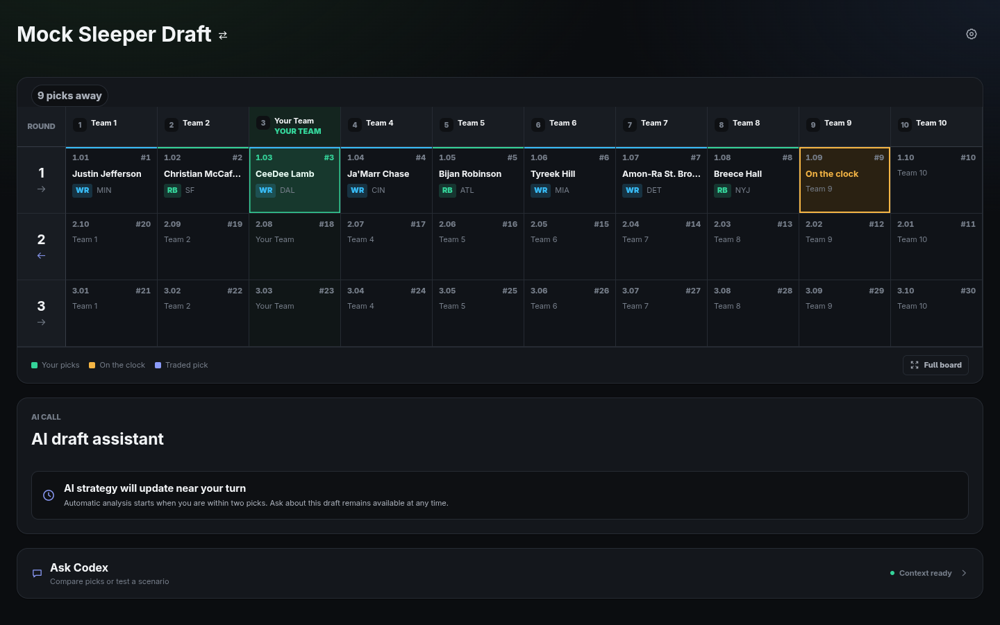

# Sleeper Draft Assistant

An unofficial, local-first fantasy football draft and team-management assistant for Sleeper.

> [!WARNING]
> This project is an early alpha. Validate every recommendation yourself, keep backups of anything important, and expect breaking changes before the first stable release.



## What it does

- Connects to Sleeper's tokenless, read-only API by username, league, or draft.
- Tracks live and completed draft boards.
- Produces deterministic recommendations from roster construction, scarcity, availability, ADP, tiers, and other explainable signals.
- Imports a FantasyPros rankings CSV that you download yourself; no ranking data is bundled or redistributed.
- Imports user-downloaded FantasyPros weekly projection CSVs by position for lineup and waiver analysis.
- Shows roster needs, lineup structure, waiver context, weekly context, and league activity.
- Offers an optional local Codex app-server provider for conversational analysis.
- Stores settings, imported rankings and projections, and decision history locally in SQLite.

Sleeper is currently the only supported fantasy platform. Sleeper search rank is a low-confidence fallback; import current rankings before relying on real-draft recommendations.

## Try the demo in about a minute

Requires Node.js 22.12 or later and npm.

```bash
git clone https://github.com/itsreverence/sleeper-draft-assistant.git
cd sleeper-draft-assistant
npm ci
npm run dev
```

Open `http://127.0.0.1:5173`, then choose **Load demo draft**. The demo uses synthetic data and requires no Sleeper account or AI provider.

## Use your Sleeper league

1. Enter your Sleeper username or user ID.
2. If needed, paste a Sleeper league URL or league ID.
3. Select the draft and confirm your team or draft slot.
4. Export rankings for your scoring format from FantasyPros and import the CSV in the app.
5. During the season, export the six weekly projection files for QB, RB, WR, TE, K, and DST, then import them together from Team Manager.
6. Review the recommendation evidence before making a pick.

The app reads Sleeper data but does not submit picks, change lineups, or modify your Sleeper account.

## AI providers

AI is optional. **Deterministic fallback** is the default and makes no external AI request.

The supported optional integration runs a locally installed Codex CLI through `codex app-server`. Provider communication stays in the local API process rather than the renderer. No provider credentials are stored by Sleeper Draft Assistant.

See [AI providers](docs/AI_PROVIDERS.md) for setup and limitations.

## Desktop builds

```bash
npm run desktop          # Electron development
npm run desktop:package  # unpacked build for the current OS
npm run desktop:make     # distributable targets
```

Release builds are currently unsigned. Windows may display a SmartScreen warning, and macOS packaging/signing is not yet supported. Only install artifacts from this repository's Releases page once releases are published.

## Local data and privacy

The packaged app stores data beneath Electron's per-user application-data directory. Development uses `data/` in the repository unless `SLEEPER_AI_DATA_DIR` is set. Stored data can include league and draft identifiers, imported rankings and weekly projections, settings, and recommendation history.

The API binds only to `127.0.0.1` and protects non-health routes with a random per-launch capability token. On POSIX systems, local data directories and files are created with owner-only permissions. Windows uses its normal per-user profile ACLs; POSIX mode bits are not a Windows security guarantee.

Read [Privacy and local data](docs/PRIVACY.md) before sharing diagnostics or deleting local state.

## Development

```bash
npm ci
npm run check
npm test
npm run build
```

Useful docs:

- [Architecture](docs/ARCHITECTURE.md)
- [Development workflow](docs/WORKFLOW.md)
- [Roadmap](docs/ROADMAP.md)
- [Release process](docs/RELEASING.md)
- [Contributing](CONTRIBUTING.md)
- [Security policy](SECURITY.md)

## Status and support

This is active alpha software. Use [GitHub Issues](https://github.com/itsreverence/sleeper-draft-assistant/issues) for reproducible bugs and scoped feature requests. Do not post tokens, private league data, imported rankings, or unredacted diagnostics.

## Unofficial project notice

Sleeper Draft Assistant is an independent project and is not affiliated with, endorsed by, or sponsored by Sleeper, FantasyPros, OpenAI, or ChatGPT. Sleeper, FantasyPros, OpenAI, ChatGPT, Codex, and related marks belong to their respective owners.

## License

[MIT](LICENSE)
